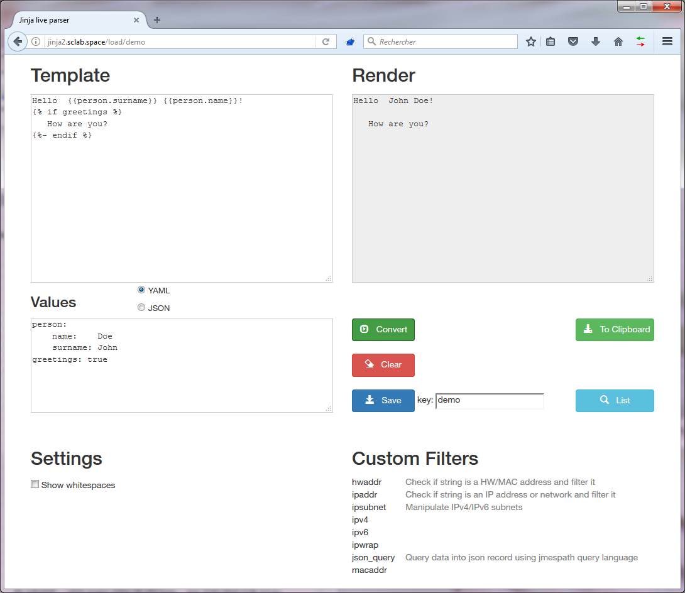
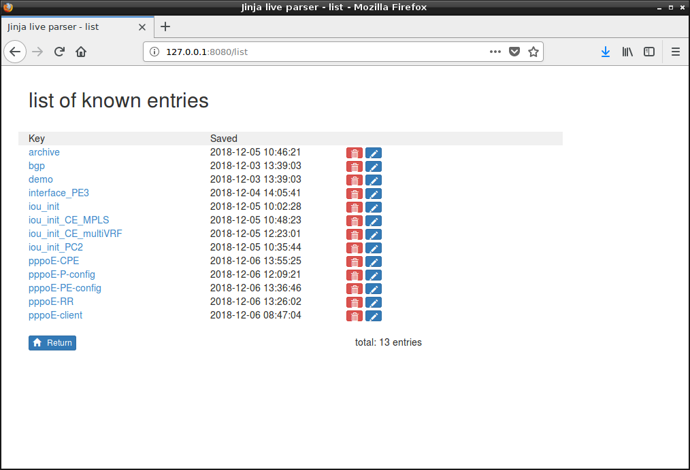

# Jinja2 live parser with database

A Jinja2 live parser based on the live parser written by Antonin Bourguignon (http://github.com/abourguignon/jinja2-live-parser) with :
- a database for saving templates and data
- a copy to clipboard button
- import of all netaddr filters as they are available in ansible
- support of json_query filter built over jmespath (same as ansible)

All you need is Python and preferably [pip](https://pypi.python.org/pypi/pip). Can parse JSON and YAML inputs.

# Preview





# Install

## Option I:  Clone + pip + init database

    $ git clone https://github.com/PJO2/jinja2-live
    $ pip3 install -r requirements.txt
    $ python3 init_database.py
    $ python3 parser.py

## Option II: Jinja2 Live Parser on Alpine Linux

### Prerequisites
- Alpine Linux VM (tested on Alpine 3.19+)
  1Gb RAM, 1 CPU and 8gb hard Disk

### Install the application in the VM
Copy script build-jinja2-live-on-alpine.sh in the root directory, than start it using

```ash build-jinja2-live-on-alpine.sh```

## Option III: Use jinja2-live in a container

Need that docker is already installer.
- Clone the application

```$ git clone https://github.com/PJO2/jinja2-live```
- Build docker container using provided dockerfile

```$ docker build -t jinja2-live jinja2-live```
- Run the container with docker port mapping

```$ docker run -rm -p 8080:8080 jinja2-live```

